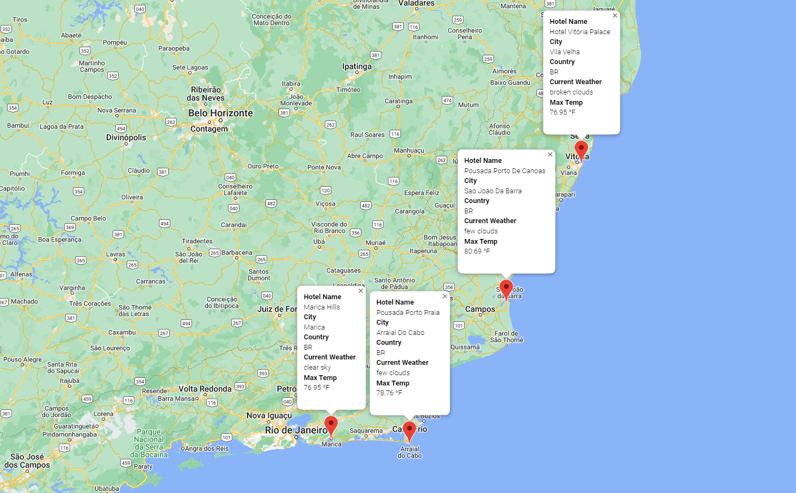

# World_Weather_Analysis

## Overview
We have assisted Jack in creating the PlanMyTrip app, which collects information based by the user detailing their travel criteria and present to them their ideal hotel anywhere for their trip. Originally, we collected 500 random latitude and longitude data points, retrieved the closest cities of these coordinates, and used the open weather API to retrieve the weather data of these randomly generated locations. This essentially created the foundation of the app and from here used Google Directions API to map out travel destinations globally. With the creation of the app, for this project, we look to perform API calls and create travel destination and itinerary maps to detail how APIs visually can assist in creating a travel program and provide a smooth and detailed user interface experience. 

## Purpose
Now, as Beta testers have loved the app, they are interested in a few slight changes. Our project now consists of implementing the requested changes as well as expanding our set from 500 to 2,000 randomly generated latitudes and longitudes and retrieving the nearest cities. Utilizing API calls with the OpenWeatherMap and Google Directions, we also collect the cities corresponding current temperature and weather description. The app is now constructed to support user input statements to obtain their weather preferences for their travels, which are now also a criteria marker to identify potential travel destinations. We create one example of a customer’s possible travel destination and depict a travel route between for selected cities. Utilizing API calls as well as the creation of these maps puts global data at the grasp of our hands to model and envision real-life travel scenarios.  

